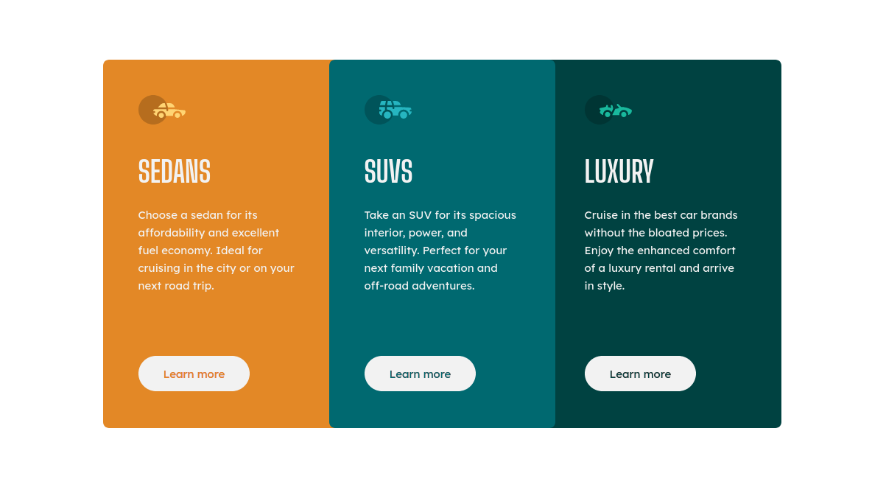

# Frontend Mentor - 3-column preview card component solution

This is a solution to the [3-column preview card component solution](https://www.frontendmentor.io/challenges/3column-preview-card-component-pH92eAR2-/hub). Frontend Mentor challenges help you improve your coding skills by building realistic projects. 

## Table of contents

- [Overview](#overview)
  - [The challenge](#the-challenge)
  - [Screenshot](#screenshot)
  - [Links](#links)
- [My process](#my-process)
  - [Built with](#built-with)
  - [What I learned](#what-i-learned)
  - [Continued development](#continued-development)
  - [Useful resources](#useful-resources)
- [Author](#author)
- [Acknowledgments](#acknowledgments)


## Overview

### The challenge

Users should be able to:

- View the optimal layout depending on their device's screen size
- See hover and focus states for interactive elements

### Screenshot




### Links

- Solution URL: [3-column](https://github.com/qqqzxcqqq/3-column)
- Live Site URL: [3-column](https://qqqzxcqqq.github.io/3-column/)

## My process

### Built with

- Semantic HTML5 markup
- CSS custom properties
- Mobile-view screen


### What I learned


```html
<img src="./images/icon-sedans.svg" alt="" width="64" height="40" /
```
```css
--font-fallback: -apple-system, BlinkMacSystemFont, "Segoe UI", Roboto, Oxygen, Ubuntu, Cantarell, "Open Sans",
    "Helvetica Neue", sans-serif;
  --font-primary: "Lexend Deca", var(--font-fallback);
  --font-secondary: "Big Shoulders Display", var(--font-fallback);
```


### Continued development

As for me, i would add:
Show your products or services
Show event information

### Useful resources

- [Resource 1](https://www.example.com) - This helped me for XYZ reason. I really liked this pattern and will use it going forward.
- [Resource 2](https://www.example.com) - This is an amazing article which helped me finally understand XYZ. I'd recommend it to anyone still learning this concept.


## Author

- Website - [qqqzxcqqq](https://www.frontendmentor.io/profile/qqqzxcqqq)

## Acknowledgments

i want to say thanks to me
